本系统是一个基于springBoot的在线购物商城
技术：springboot，mybatis,jsp,html,layui,shiro等
功能：有三种用户：管理员，卖家，买家
管理员：客户信息管理，商品分类管理，物流信息管理
卖家：商品信息管理，物流信息查看，订单信息管理
买家：登陆注册，购物车，我的订单，我的收藏，地址管理

源码下载地址：http://www.manoncode.cn/details?id=3

运行截图：

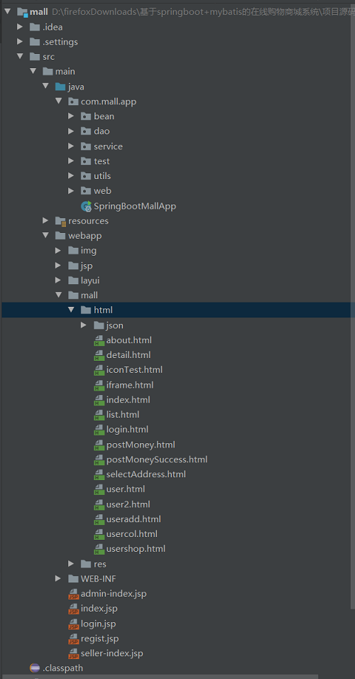

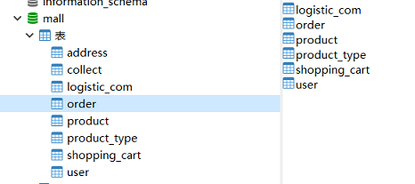

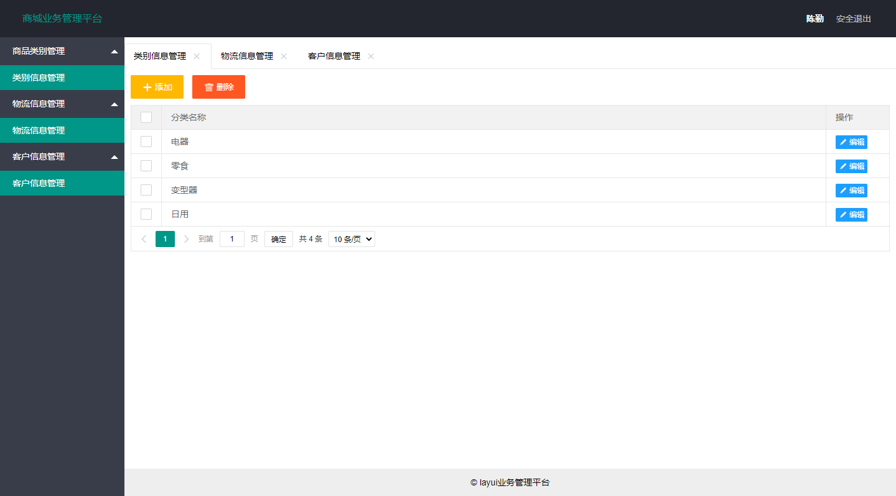

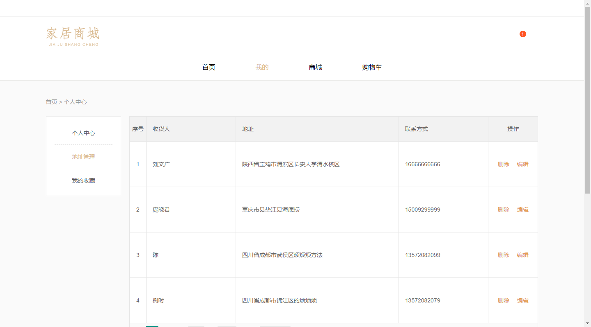

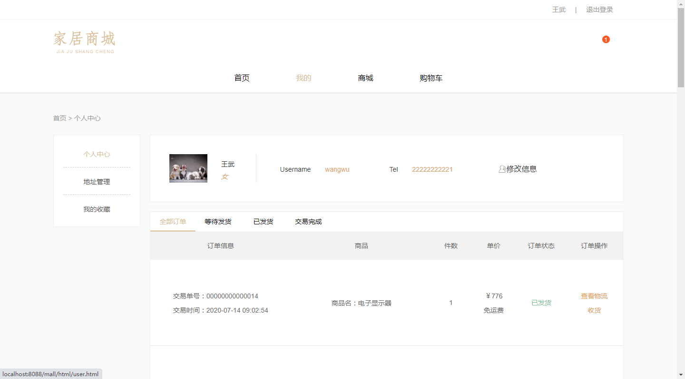

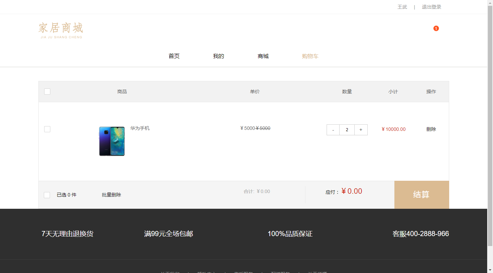

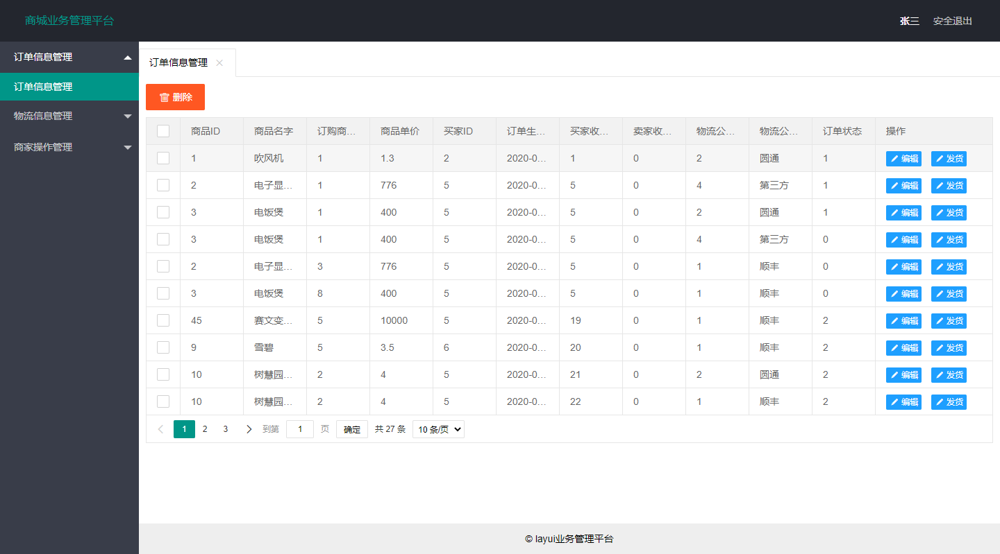

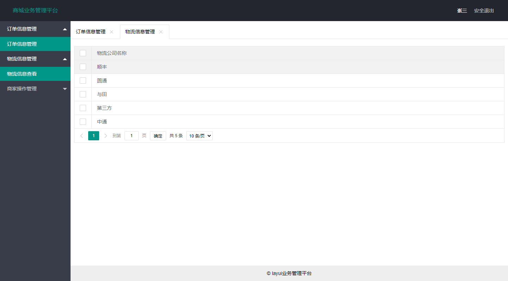

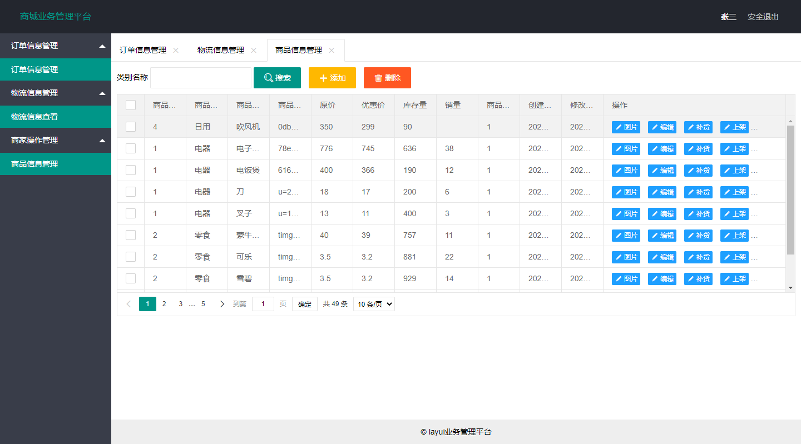

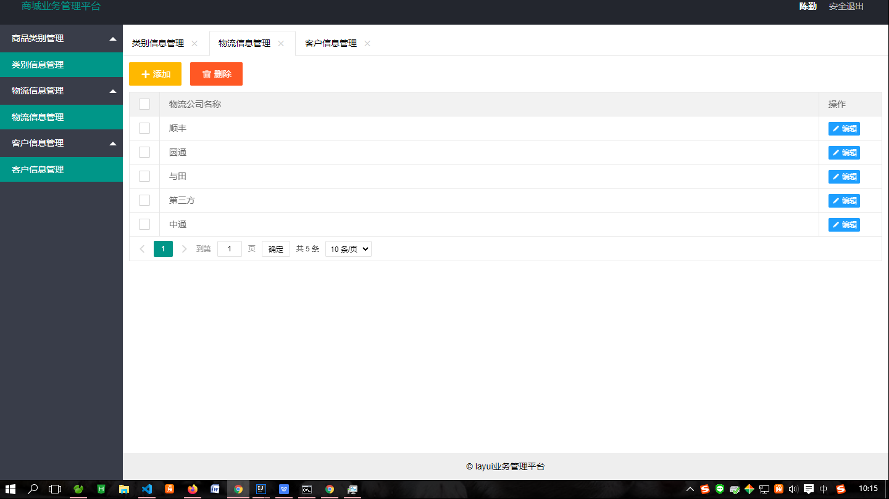

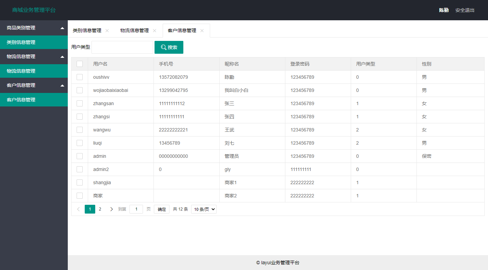
